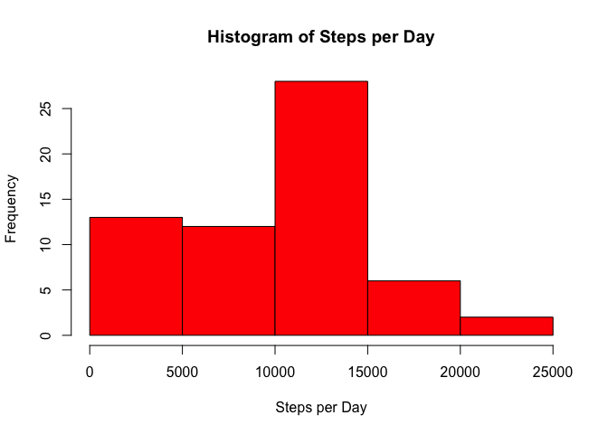
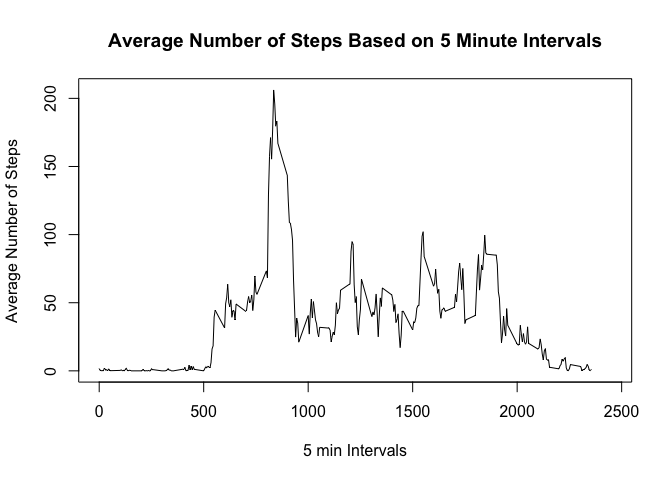
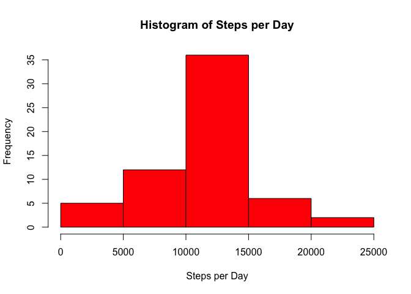
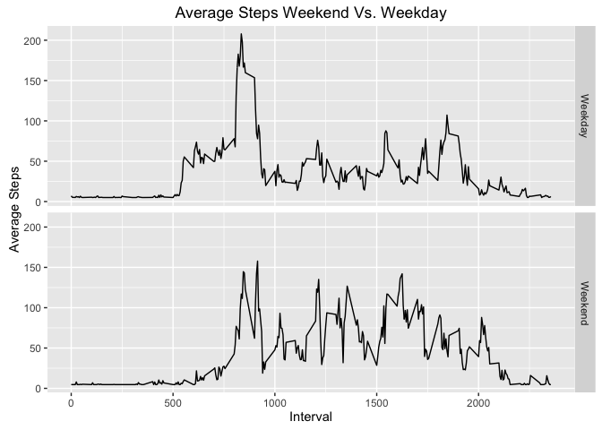

# Reproducible Research: Peer Assessment 1


## Loading and preprocessing the data
The following read.csv() function reads in the data for the activity tracker.

```r
tracker <- read.csv("./activity.csv")
```
Using the head() function, you can see the first few rows of the data. I used the class() function to check what the classes were for many of the columns.

```r
head(tracker)
```

```
##   steps       date interval
## 1    NA 2012-10-01        0
## 2    NA 2012-10-01        5
## 3    NA 2012-10-01       10
## 4    NA 2012-10-01       15
## 5    NA 2012-10-01       20
## 6    NA 2012-10-01       25
```

```r
class(tracker$date)
```

```
## [1] "factor"
```

```r
class(tracker$interval)
```

```
## [1] "integer"
```
After reviewing some of the data, I created a new column that was a factor variable of the interval column in the dataset.

```r
tracker$factorinterval <- as.factor(tracker$interval)
```

## What is mean total number of steps taken per day?
In order to calculate the mean number of steps taken per day, I had to calculate the number of steps taken per day.  The following code does this.

```r
stepsday <- with(tracker, tapply(steps, date, sum, na.rm = TRUE))
```

From there, I created a histogram of the steps per day.

```r
hist(stepsday, xlab = "Steps per Day", main = "Histogram of Steps per Day", 
     col = "red")
```

 

After creating the histogram, I took the mean and median of the steps per day.

```r
mean(stepsday)
```

```
## [1] 9354.23
```

```r
median(stepsday)
```

```
## [1] 10395
```
## What is the average daily activity pattern?
In order to create the time series plot, I needed to calculate the average number of steps per time interval.


```r
meaninterval <- with(tracker, tapply(steps, factorinterval, mean, 
                                     na.rm = TRUE, simplify = FALSE))
```
Using the set of data above, I created the time series plot for the number of steps per time interval.


```r
plot(unique(tracker$interval), meaninterval, type = "l", xlim = c(0, 2450), 
     xlab = "5 min Intervals", ylab = "Average Number of Steps", 
     main = "Average Number of Steps Based on 5 Minute Intervals")
```

 

The next thing I did was calculate the max of the averaged interval data to find the interval that had the most steps in the 2 months.


```r
stepsday1 <- aggregate(tracker$steps, by = list(tracker$factorinterval), 
                       FUN = mean, na.rm = TRUE)
stepsday1 <- stepsday1[order(stepsday1$x),]
tail(stepsday1, n = 1)
```

```
##     Group.1        x
## 104     835 206.1698
```

The max number of steps occured at 835 for the 2 months.

## Imputing missing values
The next task was to figure out what to do with the missing values in the data.  I first calculated the number of missing values below.


```r
sum(is.na(tracker$steps))
```

```
## [1] 2304
```

My strategy was to replace the NAs with the average steps per interval per day.  


```r
daymeans <- aggregate(tracker$steps, by = list(tracker$date), FUN = mean, 
                      na.rm = TRUE)
daymeans
```

```
##       Group.1          x
## 1  2012-10-01        NaN
## 2  2012-10-02  0.4375000
## 3  2012-10-03 39.4166667
## 4  2012-10-04 42.0694444
## 5  2012-10-05 46.1597222
## 6  2012-10-06 53.5416667
## 7  2012-10-07 38.2465278
## 8  2012-10-08        NaN
## 9  2012-10-09 44.4826389
## 10 2012-10-10 34.3750000
## 11 2012-10-11 35.7777778
## 12 2012-10-12 60.3541667
## 13 2012-10-13 43.1458333
## 14 2012-10-14 52.4236111
## 15 2012-10-15 35.2048611
## 16 2012-10-16 52.3750000
## 17 2012-10-17 46.7083333
## 18 2012-10-18 34.9166667
## 19 2012-10-19 41.0729167
## 20 2012-10-20 36.0937500
## 21 2012-10-21 30.6284722
## 22 2012-10-22 46.7361111
## 23 2012-10-23 30.9652778
## 24 2012-10-24 29.0104167
## 25 2012-10-25  8.6527778
## 26 2012-10-26 23.5347222
## 27 2012-10-27 35.1354167
## 28 2012-10-28 39.7847222
## 29 2012-10-29 17.4236111
## 30 2012-10-30 34.0937500
## 31 2012-10-31 53.5208333
## 32 2012-11-01        NaN
## 33 2012-11-02 36.8055556
## 34 2012-11-03 36.7048611
## 35 2012-11-04        NaN
## 36 2012-11-05 36.2465278
## 37 2012-11-06 28.9375000
## 38 2012-11-07 44.7326389
## 39 2012-11-08 11.1770833
## 40 2012-11-09        NaN
## 41 2012-11-10        NaN
## 42 2012-11-11 43.7777778
## 43 2012-11-12 37.3784722
## 44 2012-11-13 25.4722222
## 45 2012-11-14        NaN
## 46 2012-11-15  0.1423611
## 47 2012-11-16 18.8923611
## 48 2012-11-17 49.7881944
## 49 2012-11-18 52.4652778
## 50 2012-11-19 30.6979167
## 51 2012-11-20 15.5277778
## 52 2012-11-21 44.3993056
## 53 2012-11-22 70.9270833
## 54 2012-11-23 73.5902778
## 55 2012-11-24 50.2708333
## 56 2012-11-25 41.0902778
## 57 2012-11-26 38.7569444
## 58 2012-11-27 47.3819444
## 59 2012-11-28 35.3576389
## 60 2012-11-29 24.4687500
## 61 2012-11-30        NaN
```

However, 8 of the days have missing values so, I averaged all of the days from the dataset above and replaced the NAs with that average. The code below does the replacement of the NAs for the aggregated data above.


```r
rounded <- mean(tracker$steps, na.rm = TRUE)
daymeans[is.na(daymeans)] <- rounded
daymeans
```

```
##       Group.1          x
## 1  2012-10-01 37.3825996
## 2  2012-10-02  0.4375000
## 3  2012-10-03 39.4166667
## 4  2012-10-04 42.0694444
## 5  2012-10-05 46.1597222
## 6  2012-10-06 53.5416667
## 7  2012-10-07 38.2465278
## 8  2012-10-08 37.3825996
## 9  2012-10-09 44.4826389
## 10 2012-10-10 34.3750000
## 11 2012-10-11 35.7777778
## 12 2012-10-12 60.3541667
## 13 2012-10-13 43.1458333
## 14 2012-10-14 52.4236111
## 15 2012-10-15 35.2048611
## 16 2012-10-16 52.3750000
## 17 2012-10-17 46.7083333
## 18 2012-10-18 34.9166667
## 19 2012-10-19 41.0729167
## 20 2012-10-20 36.0937500
## 21 2012-10-21 30.6284722
## 22 2012-10-22 46.7361111
## 23 2012-10-23 30.9652778
## 24 2012-10-24 29.0104167
## 25 2012-10-25  8.6527778
## 26 2012-10-26 23.5347222
## 27 2012-10-27 35.1354167
## 28 2012-10-28 39.7847222
## 29 2012-10-29 17.4236111
## 30 2012-10-30 34.0937500
## 31 2012-10-31 53.5208333
## 32 2012-11-01 37.3825996
## 33 2012-11-02 36.8055556
## 34 2012-11-03 36.7048611
## 35 2012-11-04 37.3825996
## 36 2012-11-05 36.2465278
## 37 2012-11-06 28.9375000
## 38 2012-11-07 44.7326389
## 39 2012-11-08 11.1770833
## 40 2012-11-09 37.3825996
## 41 2012-11-10 37.3825996
## 42 2012-11-11 43.7777778
## 43 2012-11-12 37.3784722
## 44 2012-11-13 25.4722222
## 45 2012-11-14 37.3825996
## 46 2012-11-15  0.1423611
## 47 2012-11-16 18.8923611
## 48 2012-11-17 49.7881944
## 49 2012-11-18 52.4652778
## 50 2012-11-19 30.6979167
## 51 2012-11-20 15.5277778
## 52 2012-11-21 44.3993056
## 53 2012-11-22 70.9270833
## 54 2012-11-23 73.5902778
## 55 2012-11-24 50.2708333
## 56 2012-11-25 41.0902778
## 57 2012-11-26 38.7569444
## 58 2012-11-27 47.3819444
## 59 2012-11-28 35.3576389
## 60 2012-11-29 24.4687500
## 61 2012-11-30 37.3825996
```

I then replaced the NAs with the average with the code below.  The average was around 37.  I then checked to see if all the missing values were replaced.


```r
tracker$steps[tracker$date == '2012-10-01'] <- daymeans$x[daymeans$Group.1 == '2012-10-01']
tracker$steps[tracker$date == '2012-10-08'] <- daymeans$x[daymeans$Group.1 == '2012-10-08']
tracker$steps[tracker$date == '2012-11-01'] <- daymeans$x[daymeans$Group.1 == '2012-11-01']
tracker$steps[tracker$date == '2012-11-04'] <- daymeans$x[daymeans$Group.1 == '2012-11-04']
tracker$steps[tracker$date == '2012-11-09'] <- daymeans$x[daymeans$Group.1 == '2012-11-09']
tracker$steps[tracker$date == '2012-11-10'] <- daymeans$x[daymeans$Group.1 == '2012-11-10']
tracker$steps[tracker$date == '2012-11-14'] <- daymeans$x[daymeans$Group.1 == '2012-11-14']
tracker$steps[tracker$date == '2012-11-30'] <- daymeans$x[daymeans$Group.1 == '2012-11-30']
```

Here is the calculation of missing values.

```r
sum(is.na(tracker$steps))
```

```
## [1] 0
```

I then created a histogram of the new dataset without NAs.


```r
stepsday1 <- with(tracker, tapply(steps, date, sum, na.rm = TRUE))
hist(stepsday1, xlab = "Steps per Day", main = "Histogram of Steps per Day", 
     col = "red")
```

 

I then calculated the mean and median of the new dataset.


```r
mean(stepsday1)
```

```
## [1] 10766.19
```

```r
median(stepsday1)
```

```
## [1] 10766.19
```

Both the median and the mean are now higher than the original dataset with missing values.

## Are there differences in activity patterns between weekdays and weekends?
The first thing to do when checking the differences between the weekend and weekdays was to create a weekday variable.  This is done below.


```r
tracker$weekday <- as.Date(tracker$date, format = "%Y-%m-%d")
tracker$weekday <- weekdays(tracker$weekday)
tracker$weekday[tracker$weekday == "Monday"] <- "Weekday"
tracker$weekday[tracker$weekday == "Tuesday"] <- "Weekday"
tracker$weekday[tracker$weekday == "Wednesday"] <- "Weekday"
tracker$weekday[tracker$weekday == "Thursday"] <- "Weekday"
tracker$weekday[tracker$weekday == "Friday"] <- "Weekday"
tracker$weekday[tracker$weekday == "Saturday"] <- "Weekend"
tracker$weekday[tracker$weekday == "Sunday"] <- "Weekend"
tracker$weekday <- as.factor(tracker$weekday)
head(tracker)
```

```
##     steps       date interval factorinterval weekday
## 1 37.3826 2012-10-01        0              0 Weekday
## 2 37.3826 2012-10-01        5              5 Weekday
## 3 37.3826 2012-10-01       10             10 Weekday
## 4 37.3826 2012-10-01       15             15 Weekday
## 5 37.3826 2012-10-01       20             20 Weekday
## 6 37.3826 2012-10-01       25             25 Weekday
```

The next thing to do was to create a panel plot to show the average number of steps per 5 min interval for weekdays and weekends.  I first subsetted the data into weekends and weekdays.


```r
weekday <- subset(tracker, tracker$weekday == "Weekday")
weekend <- subset(tracker, tracker$weekday == "Weekend")
```

I then calculated the means of each dataset based on the intervals.


```r
meanweekday <- with(weekday, tapply(steps, factorinterval, mean, 
                                     na.rm = TRUE, simplify = TRUE))
meanweekend <- with(weekend, tapply(steps, factorinterval, mean, 
                                    na.rm = TRUE, simplify = TRUE))
```

I then created a data frame of the means for weekends and weekdays to make it easier to plot the data.


```r
intval <- c(unique(tracker$interval), unique(tracker$interval))
days <- rep("Weekday", times = 288)
ends <- rep("Weekend", times = 288)
dfstep <- c(meanweekday, meanweekend)
week <- c(days, ends)
means <- data.frame(intval, dfstep, week)
head(means)
```

```
##   intval   dfstep    week
## 1      0 7.006569 Weekday
## 2      5 5.384347 Weekday
## 3     10 5.139902 Weekday
## 4     15 5.162124 Weekday
## 5     20 5.073235 Weekday
## 6     25 6.295458 Weekday
```

I then used the ggplot to plot the data based on weekends and weekdays.

```
## Warning: package 'ggplot2' was built under R version 3.2.3
```


```r
ggplot(data = means, aes(intval, dfstep, fill = week)) + geom_line() +
      facet_grid(week ~ .) + xlab("Interval") +
      ylab("Average Steps") + ggtitle("Average Steps Weekend Vs. Weekday")
```

 
